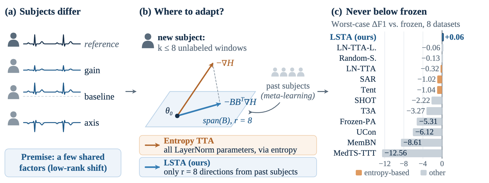
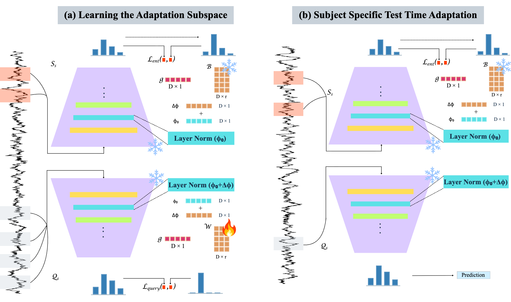
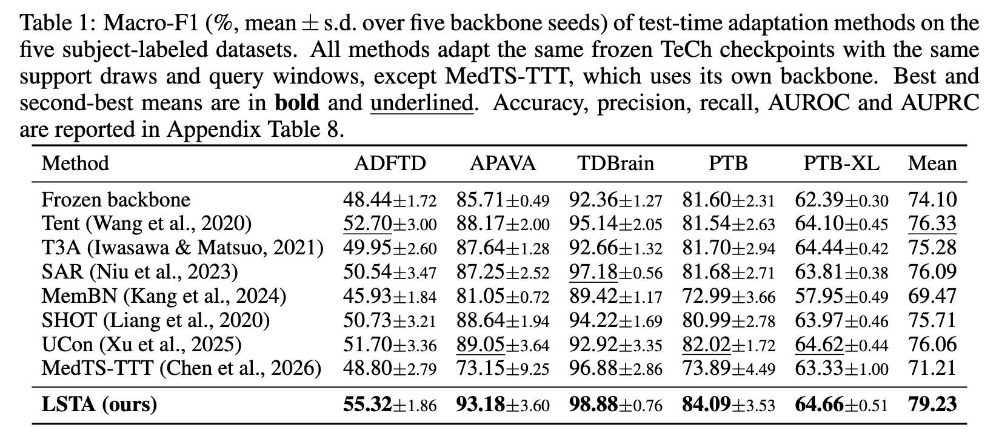
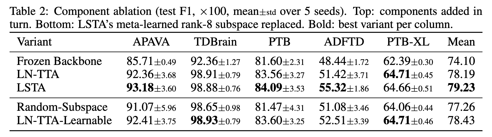
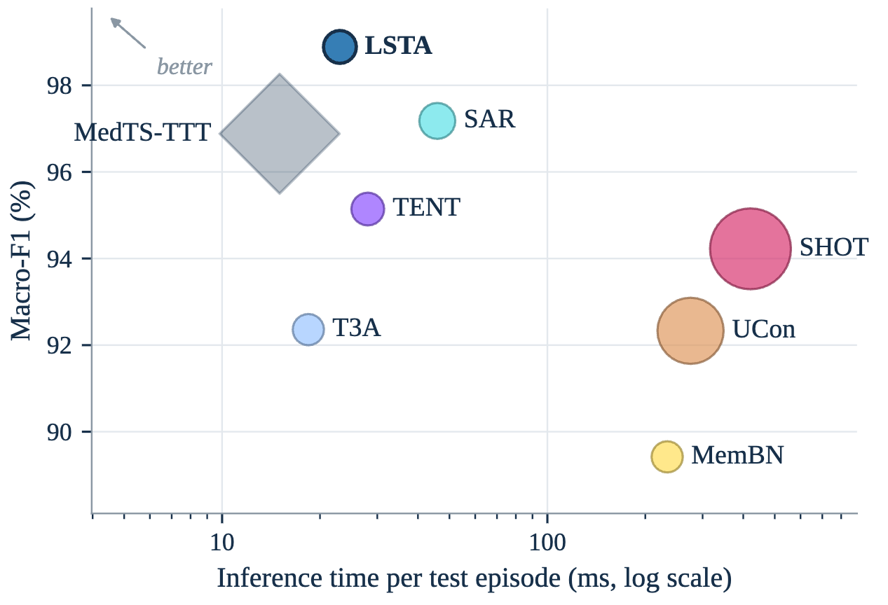
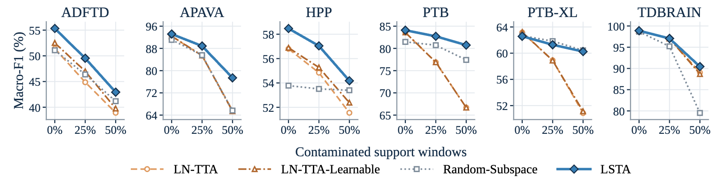

<h1 align="center">
<strong>Learning Where to Adapt: Learned Subspace Test-Time Adaptation for Medical Time Series</strong>
</h1>

<div align="center">

<a href="https://git.io/typing-svg">

</a>

[-B31B1B?style=for-the-badge&logo=arxiv&logoColor=white)](#-citation)
[](https://adinathdukre.github.io/LSTA/)
[](https://huggingface.co/adidukrembzuai/LSTA)
[](#-installation)
[](#-overview)
[](https://visitorbadge.io/status?path=https%3A%2F%2Fgithub.com%2Fadinathdukre%2FLSTA)

<h3>📄 <a href="#-citation">Paper</a> &nbsp;|&nbsp; 🌐 <a href="https://adinathdukre.github.io/LSTA/">Project Page</a> &nbsp;|&nbsp; 🤗 <a href="https://huggingface.co/adidukrembzuai/LSTA">Checkpoints</a> &nbsp;|&nbsp; 🧠 <a href="#-method">Method</a> &nbsp;|&nbsp; ⚡ <a href="#-running-experiments">Run</a></h3>

<b><a href="https://github.com/adinathdukre">Adinath Dukre</a><sup>1,2&#42;</sup>, Sandun Herath<sup>2&#42;</sup>, Imran Razzak<sup>1,2</sup></b>

<sup>1</sup>Mohamed bin Zayed University of Artificial Intelligence, Abu Dhabi, UAE &nbsp;&nbsp; <sup>2</sup>Vitalverse &nbsp;&nbsp; <sup>&#42;</sup>Equal contribution


</div>

## 🔥 News
- **[Oct 2026]** 🚀 Code for LSTA is released. The arXiv preprint and pretrained checkpoints are coming soon.

## Overview
Official code for **LSTA (Learned Subspace Test-Time Adaptation)**.

Test-time adaptation (TTA) promises to personalize medical time series classifiers to a new subject from a few unlabeled recordings. Its standard recipe, entropy minimization over normalization parameters, follows the model's uncertainty rather than the ways in which subjects actually differ, and with few windows it can turn correct predictions into errors. LSTA instead **learns where to adapt**: it meta-learns from past subjects a low-rank space of LayerNorm updates and restricts each new subject's adaptation to it.

<p align="center">

<em><b>Fig. 1.</b> Overview of LSTA. (a) Premise: recordings from different subjects differ through a few shared factors such as gain, baseline and electrical axis (schematic; traces are illustrative, not measured data). (b) Entropy-based test-time adaptation moves every LayerNorm parameter along the model's uncertainty, whereas LSTA restricts the update of a new subject to a low-rank subspace meta-learned from past subjects. (c) Measured worst-case change in macro-F1 relative to the frozen backbone across the eight datasets; LSTA is the only method that never falls below the frozen model.</em>
</p>

## 📖 Contents
- [🧠 Method](#-method)
- [🏆 Results](#-results)
- [📊 Datasets](#-datasets)
- [⛏️ Installation](#️-installation)
- [⚡ Running experiments](#-running-experiments)
- [🗂️ Repository Structure](#️-repository-structure)
- [📝 Citation](#-citation)
- [📚 Acknowledgments](#-acknowledgments)
- [📨 Contact](#-contact)

## 🧠 Method

<p align="center">

<em><b>Fig. 2.</b> (a) Learning the adaptation subspace: unlabeled support windows determine an entropy-based LayerNorm update within a shared low-dimensional space. Classification loss on separate labeled query windows trains the adaptation basis, while the pretrained source parameters remain fixed. (b) Subject-specific test-time adaptation: the learned basis is frozen, and unlabeled support windows from an unseen subject determine the LayerNorm update used to classify that subject's query windows.</em>
</p>

- **Learned adaptation subspace.** Inter-subject shift is plausibly driven by a few shared physiological and recording factors, so LSTA restricts subject-specific LayerNorm updates to a shared low-rank subspace learned from training subjects.
- **Meta-training.** For each training subject, unlabeled support windows determine an entropy step within the subspace, and the classification loss on labeled query windows from the same subject shapes the subspace.
- **Test time.** The subspace is fixed, all parameters outside LayerNorm stay frozen, and each new subject adapts from at most eight unlabeled windows.

## 🏆 Results

As reported in the paper:

- On five EEG and ECG benchmarks with subject-exclusive splits, LSTA obtains the highest mean accuracy and macro-F1 among seven TTA baselines.
- A learned subspace outperforms a random one in 22 of 25 dataset-seed pairs.
- Across all eight datasets evaluated, LSTA is the only method whose macro-F1 never falls below that of the frozen model.
- Under contaminated support, LSTA degrades far less than direct LayerNorm adaptation and turns fewer correct predictions into errors. On clean data, its gain over direct LayerNorm adaptation is concentrated on one dataset.

<p align="center">

<em><b>Table 1.</b> Macro-F1 (%, mean ± s.d. over five backbone seeds) of test-time adaptation methods on the five subject-labeled datasets. All methods adapt the same frozen TeCh checkpoints with the same support draws and query windows, except MedTS-TTT, which uses its own backbone.</em>
</p>

<p align="center">

<em><b>Table 2.</b> Component ablation (test F1, ×100, mean ± s.d. over 5 seeds). Top: components added in turn. Bottom: LSTA's meta-learned rank-8 subspace replaced.</em>
</p>

<p align="center">

<br/>
<em><b>Fig. 3.</b> Performance and efficiency on TDBRAIN. Test macro-F1 against inference time per test episode (log scale); bubble size indicates FLOPs, and the upper-left corner is better.</em>
</p>

<p align="center">

<em><b>Fig. 4.</b> Robustness to support contamination across six subject-labeled datasets. 0%, 25% or 50% of the support windows are replaced with windows from another subject of a different diagnostic class. Curves show mean macro-F1 across five backbone seeds and five support draws per seed.</em>
</p>

## 📊 Datasets

| Dataset | Signal | Subjects | Classes | Label |
|---|:---:|---:|:---:|:---:|
| ADFTD | EEG | 88 | 3 | subject |
| APAVA | EEG | 23 | 2 | subject |
| TDBrain | EEG | 72 | 2 | subject |
| PTB | ECG | 198 | 2 | subject |
| PTB-XL | ECG | 17,596 | 5 | subject |

This repository provides scripts for the five subject-labeled benchmarks above. The paper additionally reports MIT-BIH, Sleep-EDF and HPP.

## ⛏️ Installation

```bash
git clone https://github.com/adinathdukre/LSTA.git
cd LSTA
pip install -r requirements.txt
```

The code requires PyTorch 2.x. For GPU execution, install a PyTorch build compatible with your CUDA environment.

## ⚡ Running experiments

### Data preparation

Download the datasets from [Medformer](https://github.com/DL4mHealth/Medformer) and follow TeCh's preprocessing and subject-independent split protocol. TDBRAIN requires permission from the dataset provider.

Place the prepared datasets in their corresponding folders:

```text
./data/ADFTD/
./data/APAVA/
./data/TDBRAIN/
./data/PTB/
./data/PTB-XL/
```

Each dataset folder should contain `Feature/` and `Label/label.npy`, following the format expected by the data loaders.

### Pretrained checkpoints

Download the pretrained TeCh backbone checkpoints from [Hugging Face](https://huggingface.co/adidukrembzuai/LSTA/tree/main).

Place the downloaded `checkpoints/` folder in the repository root, preserving its directory structure:

```text
./checkpoints/baseline/<DATASET>/<experiment_name>/checkpoint.pth
```

These are source backbone checkpoints. The experiment scripts train and save the learned LSTA adaptation bases separately.

### Launch scripts

Dataset-specific scripts are provided under `./scripts/`. Run commands from the repository root.

For example, run APAVA with:

```bash
bash ./scripts/APAVA.sh
```

To select a GPU:

```bash
GPU=1 bash ./scripts/APAVA.sh
```

Run the other datasets with:

```bash
bash ./scripts/ADFTD.sh
bash ./scripts/TDBRAIN.sh
bash ./scripts/PTB.sh
bash ./scripts/PTB-XL.sh --tune_subjects 400
```

The scripts train the adaptation basis, select its configuration using validation macro-F1, and evaluate on test subjects. Matching saved basis checkpoints are reused automatically.

### View results

Training records, learned bases, and evaluation results are saved under:

```text
./runs/logs/TTA_SWEEP/<DATASET>/
```

Per-seed results are saved in `test_result.json` and `test_result.txt`. Aggregated results are saved in `summary.json` and `summary.txt`.

## 🗂️ Repository Structure

```text
LSTA/
├── run.py               # TeCh backbone training
├── tta.py               # LSTA subspace learning, model selection and test-time evaluation
├── data_provider/       # dataset loaders and subject-window sampling
├── exp/                 # training and TTA evaluation loops
├── models/              # TeCh backbone and encoder
├── scripts/             # one launch script per dataset
├── utils/               # losses, metrics, augmentation, logging
└── requirements.txt
```

## 📝 Citation

If you find our paper and code useful in your research, please cite:

```bibtex
@article{dukre2026lsta,
  title={Learning Where to Adapt: Learned Subspace Test-Time Adaptation for Medical Time Series},
  author={Dukre, Adinath and Herath, Sandun and Razzak, Imran},
  journal={arXiv preprint},
  year={2026}
}
```

## 📚 Acknowledgments

This project builds on TeCh and [Medformer](https://github.com/DL4mHealth/Medformer). We thank their authors for sharing their code and preprocessing resources.

## 📨 Contact
For questions or collaboration, please open an [issue](https://github.com/adinathdukre/LSTA/issues) or reach out to [Adinath Dukre](https://github.com/adinathdukre).

> [!IMPORTANT]
> LSTA is intended for research only. It is not approved for clinical use and must not inform any diagnostic or treatment decision.
